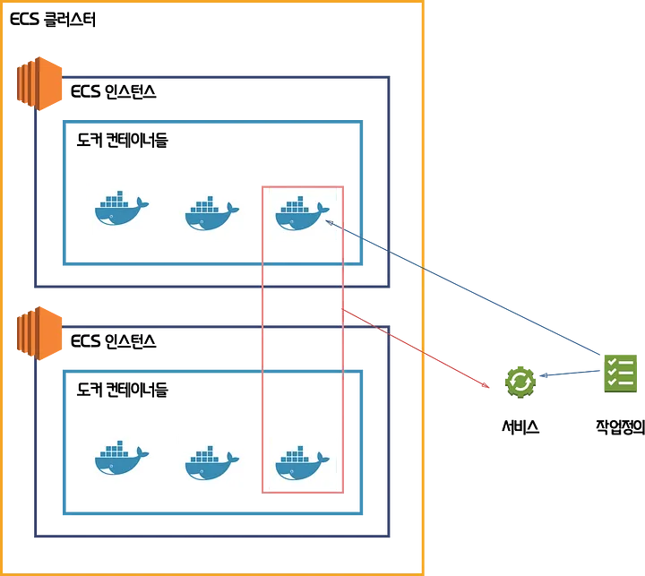

# ECS란?

[참고: ecs를 시작하기전 알았으면 좋았을 것들](https://medium.com/harrythegreat/ecs%EB%A5%BC-%EC%8B%9C%EC%9E%91%ED%95%98%EA%B8%B0%EC%A0%84-%EC%95%8C%EC%95%98%EC%9C%BC%EB%A9%B4-%EC%A2%8B%EC%95%98%EC%9D%84-%EA%B2%83%EB%93%A4-1-%EC%9A%A9%EC%96%B4-%EC%84%A4%EB%AA%85-92dbfb9d59f7)

[참고: [AWS] ECS 기본 개념](https://countrymouse.tistory.com/entry/awsecs)

## 구성 요소
1. ECR
1. 컨테이너 인스턴스
2. 클러스터
3. 작업정의
4. 작업
5. 서비스

### ECR
아마존에서 제공하는 컨테이너 이미지 저장소

ECR에서 이미지 URI 이용해 빌드한 이미지 푸시하고 가져올 수 있음

### 컨테이너 인스턴스
도커구동을 위해서 작동하는 EC2 인스턴스

일반 EC2와 마찬가지로 오토스케일링 가능/타입과 사이즈 선택 가능
### 클러스터
작업 또는 서비스의 논리적 그룹\
서비스나 태스크가 실행되는 공간을 나누는 논리적인 공간으로 ECS의 가장 기본적인 단위

가용영역과 지역 설정 가능
### 작업정의
애플리케이션을 구성하는 컨테이너를 설명하는 텍스트, 태스크 실행 위한 정의

예
* 시작 유형
* 사용할 컨테이너 이미지
* 개방할 포트
* 데이터 볼륨 설정 등
### 작업
작업 정의에서 정의된 설정으로 인스턴스화 하는 것\
컨테이너를 실행하는 최소 단위이며, 하나 이상의 컨테이너로 구성됨

작업은 클러스터에 속한 컨테이너 인스턴스(EC2 or Fargate) 에 배포됨\
각 작업은 클러스터에 종속되어 있으며 같은 호스트상에 놓임

### 서비스
클러스터에서 지정된 수의 작업을 동시에 실행하고 관리할 수 있게 해주는 구성

서비스는 작업을 포함하며 작업과 관련된 Auto Scaling, LB를 관리함

예
* 클러스터, 작업정의
* 시작유형, 작업개수
* LB, Auto Scaling 등