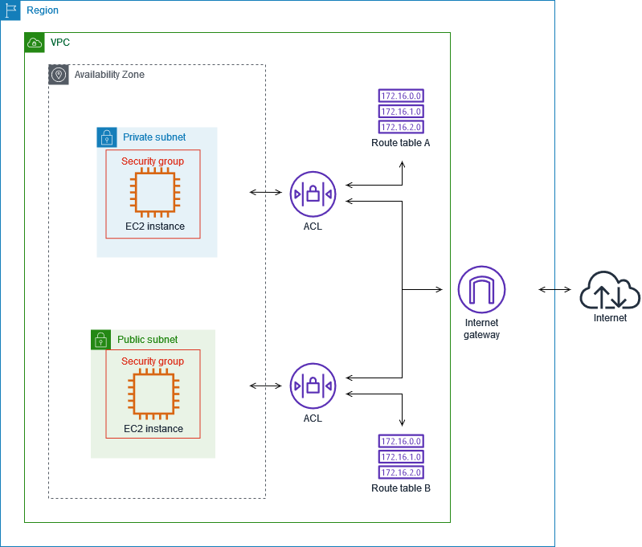

# NACL, Security Group 차이

## NACL
Network Access Contol List

* 사용자가 직접 정책 설정해서 유입되는 트래픽 제어
* 서브넷 단위로 적용, 여러개의 서브넷에 적용 가능
* 서브넷은 하나의 NACL만 적용 가능
* NACL이 설정된 서브넷 내부의 모든 인스턴스에 적용됨
* 1개의 NACL에 인바운드 20개/아웃바운드 20개를 등록할 수 있고, 규칙 번호가 낮은 것부터 우선 적용됨
## Security Group
인스턴스에 대한 인바운드/아웃바운드 트래픽을 제어하는 방화벽 역할 수행

* 인스턴스 단위 적용
* 특정 그룹 지정했을 때만 인스턴스에 적용됨

## 차이점
|NACL|SG|
|---|---|
|네트워크 방화벽|인스턴스 방화벽|
|서브넷 단위 적용|인스턴스 단위 적용|
|**stateless** 요청 정보 따로 저장하지 않아서 응답하는 트래픽에 대한 필터링 설정해야 함|**stateful** 요청 정보를 저장하여 응답하는 트래픽 제어하지 않음|