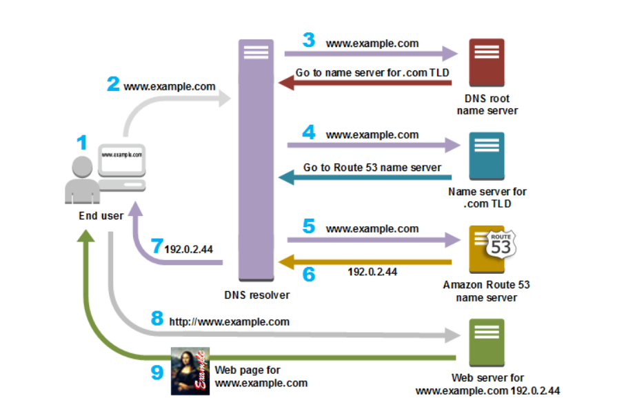
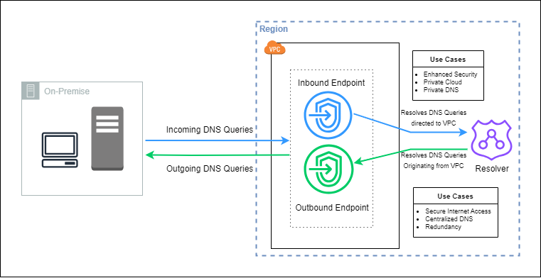

# 3. 도메인 서비스 / 로깅 & 모니터링

- [3. 도메인 서비스 / 로깅 \& 모니터링](#3-도메인-서비스--로깅--모니터링)
  - [Route 53](#route-53)
    - [DNS Record](#dns-record)
    - [Hosted Zone](#hosted-zone)
    - [Amazon DNS Server](#amazon-dns-server)
    - [Alias Record](#alias-record)
    - [Route 53 Inbound/Outbound Resolver](#route-53-inboundoutbound-resolver)
    - [ACM(Certificate Manger)](#acmcertificate-manger)
  - [Logging/Monitoring](#loggingmonitoring)
    - [CloudTrail](#cloudtrail)
    - [CloudWatch](#cloudwatch)

## Route 53
* DNS가 53port를 쓰기 때문에 위와 같은 이름을 가짐
* public/private Hosted zone에 같은 도메인 사용 가능
  * (예) public은 internet-facing 용도로, private은 VPC 내부 호출 용도로 사용
  * 이 경우, **VPC 내부에서는 private에 등록된 레코드만 조회 가능**
* 기존에 사용하고 있는 도메인의 서브도메인을 public hosted zone으로 등록해서 사용 가능
* private hosted zone의 도메인이 겹치는 경우 **가장 구체적인 hosted zone에서 조회**
* private hosted zone 사용 위해선, `enableDnsHostnames`, `enableDnsSupport` 값이 `true`여야 함
* private hosted zone은 다른 account의 VPC와도 연동 가능



총 9개의 절차로 이루어진다([출처](https://velog.io/@yjw8459/Domain-Name-Resolution))
1. 사용자가 URL 입력
2. *www<k>.example.com* 에 대한 요청은 일반적으로 케이블 인터넷 공급 업체, DSL 광대역 공급업체 혹은 기업 네트워크와 같은 ISP가 관리하는 DNS해석기로 라우팅됨
3. ISP의 DNS해석기는 *www<k>.example.com* 에 대한 요청을 DNS 루트 이름 서버에 전달
4. ISP의 DNS해석기는 *www<k>.example.com* 에 대한 요청을 .com 도메인의 TLD 이름 서버 중 하나에 다시 전달\
   .com 도메인의 이름 서버는 *exmple.com* 도메인과 연관된 4개의 Amazon Route 53 이름 서버의 이름 사용해 요청에 응답
5. ISP의 DNS 해석기는 Amazon Route 53 이름 서버 하나를 선택해 *www<k>.example.com* 에 대한 요청을 해당 이름 서버에 전달
6. Amazon Route 53 이름 서버는 *example.com* 호스팅 영역에서 *www<k>.example.com* 의 레코드를 찾아 웹 서버의 IP 주소 192.0.2.44 등 연관된 값을 받고 이 IP 주소를 DNS 해석기로 반환
7. ISP의 DNS 해석기가 사용자에게 필요한 IP 주소를 확보. 해석기는 이 값을 웹 브라우저로 반환.\
   DNS 해석기는 다음에 누군가가 *example.com* 을 탐색할 때 좀 더 빠르게 응답할 수 있도록 사용자가 지정하는 일정 기간 *example.com* 의 IP 주소를 캐싱(저장)
8. 웹 브라우저는 DNS 해석기로부터 얻은 IP 주소로 *www<k>.example.com* 에 대한 요청을 전송\
   여기가 콘텐츠가 있는 곳으로, 예를 들어 웹 사이트 엔드포인트로 구성된 Amazon S3 버킷 또는 Amazon EC2 인스턴스에서 실행되는 웹 서버임
9. 192.0.2.44에 있는 웹 서버 또는 그 밖의 리소스는 *www<k>.example.com* 의 웹 페이지를 웹 브라우저로 반환하고, 웹 브라우저는 이 페이지를 표시

### DNS Record
* 특정 도메인 주소 하나를 **어떻게 라우팅 할지에 대한 매핑**
* A: 도메인 -> IP 주소
* CNAME: 도메인 -> 다른 도메인
### Hosted Zone
* 특정 도메인 주소의 하위 도메인에 대한 DNS Records를 담고 있는 컨테이너
* Public Hosted Zone: 인터넷 상에서 공개적으로 접근 가능한 Hosted Zone
* Private Hosted Zone: 연결된 VPC 내에서만 접근 가능한 Hosted Zone
### Amazon DNS Server
* VPC 내의 자원들이 DNS 쿼리 할 수 있도록 Amazon DNS Resolver가 VPC CIDR Base + 2의 주소로 제공
  * 예) VPC CIDR: 10.0.0.0/16 -> Amazon DNS Resolver IP: 10.0.0.2(Reserved)
* Ec2 Instance 에서 `$ cat /etc/resolv.conf` 로 확인 가능
### Alias Record
* AWS Resource 로 레코드 매핑 가능
* CNAME 레코드 같아 보이지만, A레코드임
  * Server에 의해 Redirect가 숨겨짐
* 다음과 같은 자원들 선택 가능
  * API Gateway
  * Interface Endpoint
  * CloudFront
  * Elastic Load Balancer
  * $\dots$
* AWS 자원(ALB같은)의 IP변동 있을 시 자동 감지하여 변경된 IP 넘겨줌
### Route 53 Inbound/Outbound Resolver

* On-premise network와 연결이 된 경우, On-premise에서 Route 53의 private hosted zone의 도메인 레코드 조회
* 혹은 VPC에서 On-premise DNS서버의 도메인 레코드 조회 용도

### ACM(Certificate Manger)
* SSL/TLS 인증서를 관리할 수 있도록 하는 서비스
* 기존 인증서 import 가능
* ACM 이용해서 무료로 인증서 생성 가능
* private CA(certificate authority) 생성 가능
* ACM 통해 발급된 인증서의 경우, ELB, CloudFront 등 서비스에서 사용 중일 경우, 자동 갱신됨

## Logging/Monitoring
### CloudTrail
* **AWS API 호출에 대한 로그** 기록
* Event History 메뉴를 통해 90일간 현재 region에서 발생한 이벤트들 확인
* 90일 이상, 더 많은 이벤트 확인 원할 시, Trail 생성해야 함
* Athena 이용해 SQL 문법으로 CloudTrail 이벤트들 조회 가능
* 로그 확인을 통해 문제 해결에 도움을 줌
* Athena 이용한 Trail 로그 분석(로그 분석을 위한 테이블 이용)
  * (예) console에 로그인한 사람 찾기
  ```sql
  SELECT useridentity.username, eventtime
  FROM default.cloudtrail_logs_aws_cloudtrail_logs_815754164176_852c7c69
  WHERE eventname = 'ConsoleLogin'
  ```
### CloudWatch
* Monitoring/Logging 위한 기능
* EC2에 대해 기본적인 모니터링 메트릭 제공\
  CloudWatch Agent 이용해 더 많은 지표 모니터링 가능
* EventBridge, Amazon SNS 등과 연계 $\to$ Metric에 대한 threshold 설정 및 넘을 시 알림 발생 & 다양한 조치