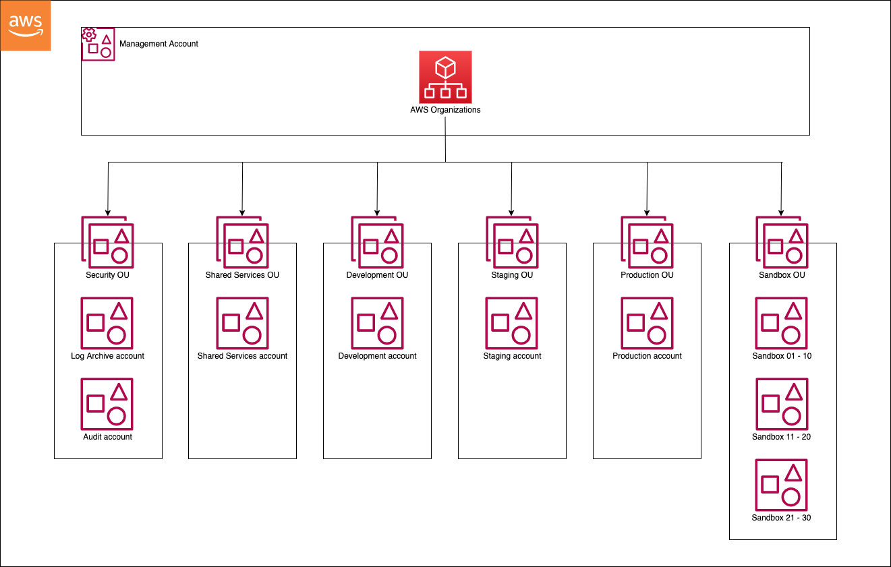

# 4. 프로젝트 사례 기반 아키텍처 분석
- [4. 프로젝트 사례 기반 아키텍처 분석](#4-프로젝트-사례-기반-아키텍처-분석)
  - [계정 구성도(8)](#계정-구성도8)
    - [공통](#공통)
    - [Network account](#network-account)
    - [Shared account(services)](#shared-accountservices)
    - [Security account](#security-account)
    - [Logging account](#logging-account)
    - [OU structure](#ou-structure)
    - [LandingZone](#landingzone)
  - [VPC \& Subnet](#vpc--subnet)

## 계정 구성도(8)
1. Master: Organization관리, Billing 관리
* Enterprise Accounts
  1. Logging: AWS 로그 관리 
  1. Security: AWS 보안 관리
  2. Shared: 공통 서비스 관리
  3. Network: 네트워크 게이트
* Prod/NonProd/Sandbox Accounts
  1. Sandbox: PoC 환경
  2. Dev: 개발/QA 환경
  3. Prod: 운영환경

landing zone에서는 일반적으로 위 8개의 계정을 기본으로 일정 variation 존재

### 공통
* DNS
  * 내부 DNS 관리
* AWS config
  * 계정 내에서 발생한 AWS자원 설정 이력에 대해 관리 및 모니터링

### Network account
* **외부와 통신할 수 있는 유일한 계정**/네트워크 관문 역할
* DNS
  * public/private hosted zone구성
  * public에서는 외부 DNS관리
  * private에서는 내부 DNS관리
* 방화벽
  * 네트워크 관문 보안을 위한 WAF(HTTP(*S*)), NGFW(TCP)구성
  * 각 방화벽 장비에서 AWS 운영서버 라우팅 설정
* 전용선
  * On-premise 연결 위한 direct connect gateway, virtual private gateway구성
* AWS 네트워크 연결
  * AWS 각 계정 네트워크 연결을 위한 **Transit Gateway 구성**

### Shared account(services)
* AWS 계정에서 **공통 서비스 관리**
* Service Catalog
  * AWS자원 자동배포 위한 포트폴리오 구성
  * NetworkService Portfolio: VPC, Subnet 생성
  * Default EC2 Portfolio: EC2 생성
* Golden Image
  * OS에 보안적용 완료한 AWS AMI 구성
* 접근 통제
  * Prod/NonProd/Sandbox 서버로 접근 위한 $^*$Bastion 서버 생성, 각 서버에 대한 접근 통제
  * $^*$Bastion: 침입 차단 SW 설치되어 내부/외부 네트워크 사이에서 일종의 게이트 역할 수행하는 호스트

### Security account
* AWS 계정 보안 관리
* Key 관리(**KMS**)
  * Landing Zone 각 계정에서 사용하는 EBS, S3 암호화에 사용하는\
  **Key에 대한 통합 관리 및 배포**
* AWS Config
  * Langing Zone 전체 계정의 config 정보 수집 및 모니터링

### Logging account
* AWS 계정 로그 관리
* 로그통합관리
  * Landing Zone 모든 계정에서 발생한 <u>AWS API로그</u>(=Cloud Trail 로그), ELB로그에 대해 S3에 저장
  * VPC flow 로그도 logging account가 저장

### OU structure
* (예1)
    

* (예2)
    * `Master`
      * `Core`
        * Logging Accounts
        * Security Accounts
        * Shared Services Accounts
        * `Network`
          * Ingress-Egress Accounts
      * `Non-prod`
        * Dev Account
      * `Prod`
        * Prod Account
        * Prod Account

### LandingZone
(예)

**landing zone에 정해진 틀은 없다**

## VPC & Subnet
* Subnet을 잘게 나눈다고 좋은 것은 아님 $\to$ IP의 낭비 발생
* DMZ Subnet
  * 내부 네트워크와 외부 네트워크 사이에 위치한 서브넷
  * 내부 네트워크와 외부 네트워크가 DMZ로 연결할 수 있도록 허용하면서\
    DMZ 내의 컴퓨터는 오직 외부 네트워크에만 연결할 수 있도록 한다
  * 네트워크의 중립지역을 의미