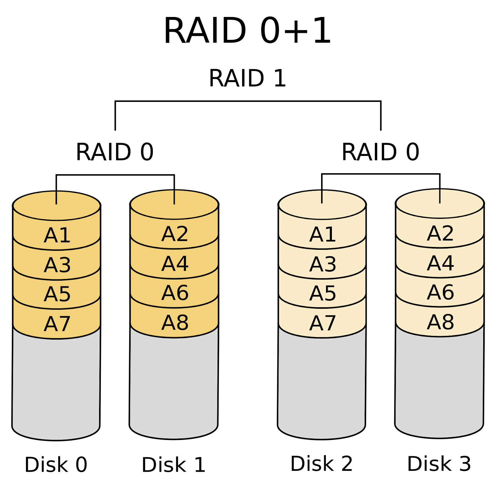
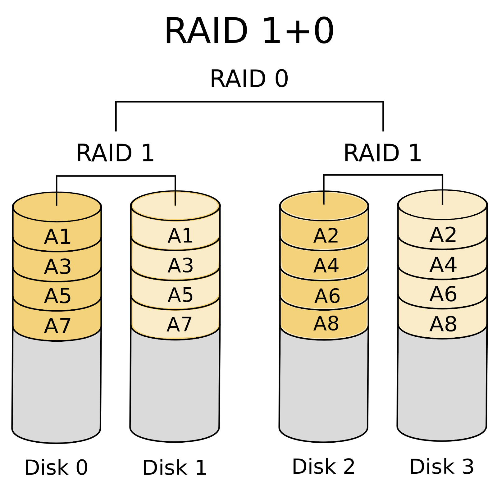

# 2.1 운영체제 개요
- [2.1 운영체제 개요](#21-운영체제-개요)
  - [OS 목적과 기능](#os-목적과-기능)
  - [OS의 구성요소](#os의-구성요소)
    - [커널](#커널)
    - [Shell](#shell)
    - [파일 시스템](#파일-시스템)
- [2.1 운영체제 개요(2)](#21-운영체제-개요2)
  - [RAID](#raid)
    - [RAID 0 - Striping](#raid-0---striping)
    - [RAOD 1 - Mirroring](#raod-1---mirroring)
    - [RAID 0+1 vs RAID 1+0](#raid-01-vs-raid-10)
    - [parity bit](#parity-bit)
    - [RAID3, RAID4](#raid3-raid4)
    - [RAID5](#raid5)
    - [RAID6](#raid6)
    - [Hot-Spare 디스크](#hot-spare-디스크)
    - [RAID구현 예](#raid구현-예)
  - [OS 주요 서비스](#os-주요-서비스)
    - [NTP(network time protocol)](#ntpnetwork-time-protocol)
    - [FTP(file transfer protocol)](#ftpfile-transfer-protocol)
    - [NFS(network file system)](#nfsnetwork-file-system)

> OS 구성에 대한 이해 및 시스템에 적용

## OS 목적과 기능
응용프로그램의 수행 제어 및 사용자와 하드웨어 사이의 인터페이스 역할을 하는 프로그램

기능\
프로세스 관리, 인터럽트, 메모리 관리, 파일시스템
\장치 드라이버, 네트워크, 보안, 입출력

목적

1. 확장성\
   다양한 하드웨어 연결 위함
2. 편리성\
   프로그램 개발 편의성\
   프로그램 개발을 위해 하드웨어 이해해야 하는 수고 줄여줌
3. 효율성\
   안정적인 하드웨어 자원의 활용\
   Multi-Tasking 등 CPU 순차처리 방식의 효율적 활용

## OS의 구성요소
1. Kernel
2. Shell
3. Filesystem

User (*user1, user2*)\
Application (*ls, cd,..*)\
==================\
File System (*NTFS, ext4*)\
Shell (*csh, bash, sh*)\
Kernel (*unix, GNU/LINUX*)\
==================\
Device (*Disk, Monitor*)

### 커널
프로세스 처리에 필요한 하드웨어 자원을 관리하는 OS의 핵심 부분

서버의 부팅 시부터 종료 시까지 계속 메모리에 상주해 있는 프로그램

커널의 역할

* 자원 관리
  * 한정된 **시스템 자원을 효율적으로 관리** -> 프로그램 실행 원활하게 함
  * 스케줄링: 프로세스 처리될 순서 관리
* 하드웨어 추상화
  * 다양하고 복잡한 하드웨어 추상화 -> 일관성 있는 인터페이스 제공
* 보안
  * 커널 영역과 사용자 영역 분리 -> 사용자 프로세스는 커널에 접근 불가
  * 사용자 프로세스는 System Call을 통해 간접적으로 커널 호출

리눅스 커널

* 시스템 콜을 통해 커널을 호출
* 맨 아래의 하드웨어들은 인터럽트를 통해 커널에 신호를 보냄
* 그 사이의 작업관리자 네트워크 관리자 디바이스 관리자 파일시스템들이 각각 커널의 역할을 수행

윈도우 커널

* Executive interface => 사용자와 I/O 함
* 맨 아래의 HAL에서 하드웨어를 추상화하고, 하드웨어와 통신함

커널 종류\
&nbsp;&nbsp;모놀리식 vs 마이크로

커널 파라미터 관리

시스템 최적화를 위해 커널에서 사용하는 변수의 값을 제어\
응용프로그램이나 DB에 따라 권고 파라미터 제공
* windows는 레지스트리 편집기에서 파라미터 수정 가능

### Shell

사용자와 커널 사이에서 인터페이스 담당\
사용자의 명령을 커널에 전달(command interpreter)

CLI, GUI 존재

주요 기능

1. 사용자가 입력한 명령어 해석하여 시스템 기능 실행
2. 프로그래밍 기능(Shell Script)
3. 사용자 환경 설정(Shell 변수 등..)

### 파일 시스템
> OS내에서 파일 저장하고 관리할 수 있도록 만들어 놓은 체계
>
> 논리적인 디스크를 파일시스템으로 만들어야 파일을 저장하여 사용할 수 있음

논리적인 디스크는 4KB의 Block 이라는 단위로 나뉘어져 있음

파일 생성시 불연속적으로 저장, 읽어들이는 방법이 필요

파일의 저장/읽기를 위해 파일의 실제적 위치, 소유자, 권한 등의 다양한 정보가 필요, 이를 **약속된 규약으로 관리하는 것이 파일시스템**

파일시스템 종류

linux
1. ext4
2. xfs
   
windows
1. FAT32
2. NFTS

파티션

OS가 인식한 디스크를 파티션으로 분할하여 사용\
분할된 파티션을 파일시스템으로 만들어 쓰거나, LVM의 PV로 사용

MBR vs GPT 파티션 비교
* MBR
  * 2TB까지만 사용 가능
  * 디스크 1개에 주 파티션 4개 혹은 주 파티션 3개 + 확장 파티션 통한 추가 파티션 생성 가능
  * 부팅 파티션을 하나만 지정 가능
  * 확장 및 논리 파티션은 부팅 파티션 불가
  * 대부분의 펌웨어/OS에서 사용 가능
  * BIOS 방식의 펌웨어에서 부팅
* GPT
  * 2TB이상 사용 가능(이론상 9ZB까지 가능)
  * 디스크 1개에 128개 파티션 생성 가능
  * 32bit Windows 및 기본 BIOS 사용하는 시스템에서는 파티션 내용 조회 불가
  * 일부 과거 버전의 OS에서는 부팅 파티션으로 사용 불가
  * UEFI 방식의 펌웨어에서 부팅

# 2.1 운영체제 개요(2)
## RAID
여러 물리적 디스크를 하나의 논리적 디스크처럼 다룰 수 있게 하는 기술

중복된 데이터를 디스크에 저장하여 디스크 장애시 데이터를 보호

특징
* 디스크 물리적 장애시, 서버 장애 및 데이터 소실이 일어나지 않도록 보호
* 스트라이핑 -> 성능 향상
* parity 구성 위한 추가적인 디스크 필요
* RAID 구성 방법에 따라 RAID level 분류

### RAID 0 - Striping
* 빠른 입/출력 가능하도록 2개 이상 드라이브에 데이터 분산 저장
* 최소 디스크 2장
* 물리적 디스크 장애 시 데이터 보호X
* I/O 빨라짐

### RAOD 1 - Mirroring
* **데이터 보호를 위함**
* 하나의 드라이브에 기록되는 모든 데이터를 다른 드라이브에 복사/저장하는 방식
* 최소 디스크 2장
* 물리적 디스크 **용량의 절반만 사용 가능**

### RAID 0+1 vs RAID 1+0
* RAID 0+1: striping 적용된 disk 그룹을 mirror 구성

* RAID 1+0: mirror 구성된 disk 그룹에 striping 적용

### parity bit
정보 전달 과정에서 오류가 생겼는지를 검사하기 위해 추가한 bit

parity bit를 포함한 전체 데이터의 합이 홀수인지 짝수인지 약속하고 parity bit를 추가

전송 도중 하나의 bit 손실시 parity bit사용하여 손실된 bit 복구 가능

### RAID3, RAID4
* **parity 정보 가지고 있는 디스크**를 추가, 물리적 디스크 장애시 데이터 보호
* 최소 디스크 3장 필요
* parity disk만큼 사용 가능한 디스크 용량 감소
* RAID3은 B단위, RAID4는 block 단위로 저장(현재는 RAID-5만 사용)
* **parity 디스크에 병목 발생**

### RAID5
* parity 정보를 레이드 그룹 전체의 디스크에 나누어 기록
* parity 용량 만큼 사용 가능한 디스크 용량 감소

### RAID6
* parity 한번 더 계산
* 최소 디스크 4장(2D + 2P)
* 디스크 2개 장애까지 데이터 보호 가능
* RAID5보다 쓰기 성능$\downarrow$

### Hot-Spare 디스크
* RAID 구성에 Hot Spare 디스크 추가
* 디스크 1개에 장애 발생 시 Hot Spare 디스크가 장애 디스크를 대체

### RAID구현 예
1. RAID Controller
2. 스토리지 RAID
3. LVM Mirror
4. LVM Stripe\
   linux는 LVM, windows는 동적 디스크를 통해 구성

## OS 주요 서비스

### NTP(network time protocol)
OS상의 시간 동기화하는데 사용하는 프로토콜

### FTP(file transfer protocol)
파일 전송 서비스

1. active mode
2. passive mode

1. ascii mode
2. binary mode

파일 전송 시 적절한 모드를 선택해야 함

### NFS(network file system)
파일시스템 공유 솔루션