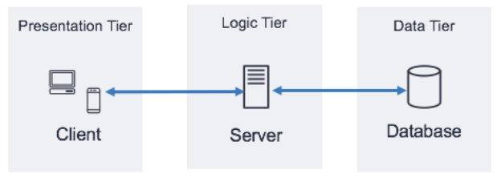
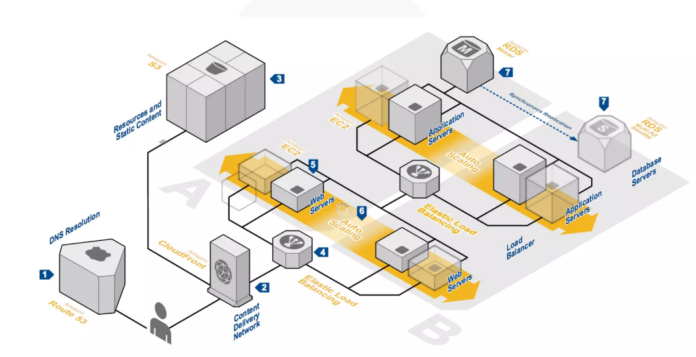

# 3.1 아키텍처 개요
- [3.1 아키텍처 개요](#31-아키텍처-개요)
  - [구축](#구축)
    - [기술 아키텍처 프로세스](#기술-아키텍처-프로세스)
    - [프로세스 소개](#프로세스-소개)
  - [ICT 인프라](#ict-인프라)
  - [아키텍처](#아키텍처)
    - [3Tier 기본 구조(Basic pattern)](#3tier-기본-구조basic-pattern)
  - [아키텍처 패턴](#아키텍처-패턴)
    - [분산 컴퓨팅](#분산-컴퓨팅)
  - [운영 환경의 변화](#운영-환경의-변화)

> 엔터프라이즈 환경에서의 시스템 고려사항과 기술요소별 변화 방향을 이해하여 필요 요소를 검토할 수 있다

시스템 Life-Cycle

* 구축 전
  * ISP / EA
  * 제안
* 구축
* 구축 후
  * 최적화

## 구축
### 기술 아키텍처 프로세스

|분석|설계|구축|테스트|전개|
|-|-|-|-|-|
|아키텍처 현황 분석 요구사항 정의 아키텍처 프레임워크 정의 아키텍처 구축계획 정의 스테이지 말 검토|아키텍처 구성요소 선정 아키텍처 설계 아키텍처 검증 스테이지 말 검토|개발 환경 구축 구축 준비 운영 환경 구축 스테이지 말 검토|통합 및 시스템 테스트 스테이지 말 검토|전개 계획 전개 실행 운영 지원 &nbsp;-장애 관리 지원 &nbsp;-성능 관리 지원 &nbsp;-운영 환경 점검 지원 &nbsp;-운영 스크립트 작성|

### 프로세스 소개
* 분석
  * 비즈니스 측면/IT 측면의 아키텍처 동기 요소들 파악 및 정의
  * 동기요인들 만족할만한 아키텍처 프레임워크와 구축계획 정의 단계
* 설계
  * 아키텍처 프레임워크에서 정의한 구성요소 선정
  * 특정 환경을 위한 기술 아키텍처 모델 설계
  * 논리 설계의 결과를 물리적 컴포넌트(선정된 제품)로 매핑
  * 아키텍처 검증 작업 수행
* 구축
  * 설계 단계에서 선정한 기술 컴포넌트를 통합된 아키텍처 환경에 설치 구성
  * 아키텍처가 지원할 응용 개발 환경의 구축도 포함
* 테스트
  * 통합 테스트/시스템 테스트 활동을 지원하기 위한 책임/역할 정의 및 절차 제공
* 전개
  * 신규 구조로의 전환 위해 사용자에게 교육 실시
  * 지속적인 감독을 요하며, 시스템 설치를 위한 모든 기술적/조직적 선결조건이 만족되었는지 확인

프로세스 주요 산출물

* 분석
    1. 현행 기반구조 설명서
    2. 요구사항 정의서
    3. 총괄 테스트 계획서
    4. 아키 프레임워크
    5. 요구사항 추적 매트릭스
* 설계
    1. 아키 구성요소 선정 보고서
    2. 아키 설계서
    3. 요구사항 추적 매트릭스
* 구축
  1. 개발환경 설계서
  2. 구매목록 및 견적서
  3. 시스템 상세 설계서
  4. 구축 시나리오
  5. 설치 확인서
  6. 요구사항 추적 매트릭스
* 테스트
  1. 통합 테스트 결과 보고서
  2. 시스템 테스트 결과 보고서
  3. 요구사항 추적 매트릭스
* 전개
  1. 전개 계획서
  2. 운영자 지침서
  3. 검수 확인서

## ICT 인프라

컴퓨팅 패러다임의 변화

1. 메인프레임 컴퓨팅
2. 클라이언트/서버 컴퓨팅
3. 웹 컴퓨팅
4. 클라우드 컴퓨팅

## 아키텍처

고려사항

1. 이중화
   * 단일 장비의 Single Point of Failure
   * 서버 이중화, 스토리지 이중화, 회선 이중화, 분산 배치
2. 확장성
   * Scale-up, Scale-out
   * 데이터 분산 처리
   * Open Source Software
3. 가상화
   * 서버 가상화, 컨테이너
   * 스토리지 가상화
   * SDx
4. 백업
   * RTO, RPO
   * 백업 장비, 백업 방식, 백업 정책
   * Disaster Recovery
5. 보안
   * 보안 취약점 조치
6. 용량 산정
   * 자원 사용량(CPU, Memory, 스토리지)
7. 테스트
   * 시스템/성능/가용성 테스트

### 3Tier 기본 구조(Basic pattern)

Baisc Pattern을 이중화 구성
  * Web server redirector
  * Application server

웹 서버를 위한 Load Balancer를 설치

Application server의 비즈니스 로직을 성격에 맞게 분리하여 기능별로 세분화한 variation 패턴도 존재

## 아키텍처 패턴
클라우드에서의 3Tier 구조(AWS)

서버리스 아키텍처(AWS)

Hybrid 클라우드 아키텍처 등등..

### 분산 컴퓨팅
하나의 대형 컴퓨터 시스템에서 수행하던 기능을 지역적으로 분산된 여러 개의 단말기에 분담후, 네트워크를 통해 상호간에 통신 및 처리

연산 속도 및 신뢰성 $\uparrow$, 컴퓨터 자원 효율적 이용

* Hadoop
  * 분산 환경에서 빅데이터를 저장하고 처리할 수 있는 하나의 프레임워크
  * JobTracker node가 자원 상황에 맞게 TaskTracker에게 작업 할당
  * HDFS(하둡 분산형 파일 시스템)
    * 대용량 데이터 분산해서 안정적 저장
    * 큰 파일을 일정 크기의 블록으로 쪼개서, 3개 복제하여 분산 저장
    * 마스터 역할의 네임 노드 및 슬레이브 역할의 데이터 노드 여러대로 구성
    * Write Once / Read Many
    * 저렴한 컴퓨터를 병렬로 여러 개 연결하여 병렬 처리
  
* GPU
  * 그래픽 처리 장치
  * 효율적 **병렬 처리 위해 수천 개 코어** 가짐
  * CUDA(compute unified device archi_): GPU 다중 코어 이용하여 병렬 계산처리 능력을 극대화하는 프로그래밍 기법

* 샤딩
  * 데이터 확장성 한계에 단일의 논리적 데이터셋을 다수의 물리적인 DB에 쪼개고 나누는 데이터 분산 아키텍처

## 운영 환경의 변화
CSR 중심의 SM 운영 -> agile, ITSM -> MSA

1. waterfall/big bang, 장애관리/CSR
2. agile, ITSM
3. MSA, DevOps

IT 운영의 인식 변화\
기술 중심의 유지/관리 $\to$ **비즈니스(사용자) 관점의 서비스 관리**로 변화

IT 운영관리 체계의 변화

과거 Reactive / Silo 방식 $\to$ Proactive(먼저 접근) / SPoC(고객접점 통합) 방식\
비즈니스를 보다 더 빠르고 효율적 지원 위한 ITSM체계로 변화