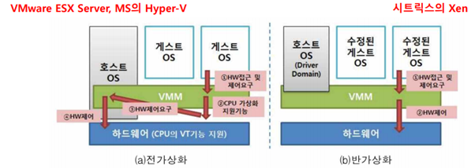

# 3.4 가상화
- [3.4 가상화](#34-가상화)
- [가상화(1)](#가상화1)
  - [서버 가상화](#서버-가상화)
    - [Hypervisor 기술](#hypervisor-기술)
- [가상화(2)](#가상화2)
  - [Docker](#docker)
    - [이미지와 컨테이너](#이미지와-컨테이너)
    - [Docker 볼륨](#docker-볼륨)
    - [Docker 네트워크](#docker-네트워크)
    - [이미지](#이미지)
    - [Docker file](#docker-file)
    - [Docker Swarm](#docker-swarm)
  - [k8s](#k8s)
    - [구조](#구조)
  - [데스크탑 가상화](#데스크탑-가상화)
  - [스토리지 가상화](#스토리지-가상화)
    - [Thin provisition](#thin-provisition)
  - [SDx(S/W defined anything/everything)](#sdxsw-defined-anythingeverything)
    - [SDDC(- data center)](#sddc--data-center)
    - [SDS(- storage)](#sds--storage)
    - [SDN(- network)](#sdn--network)
  - [HCI(Hyper-Converged Integration System)](#hcihyper-converged-integration-system)

# 가상화(1)
물리적, 논리적 자원을 추상화시켜 실제와 같은 자원으로 사용 및 관리 가능하도록 하는 기술

CPU, 메모리, 저장장치와 같은 물리적 자원 및 네트워크, 운영체제와 같은 논리적인 자원 포함

분류

* 자원의 가상화
  * 서버 가상화
    * 서버 내 가상화
    * 서버들 간 가상화
  * 스토리지 가상화
    * 블록 가상화
    * 파일 가상화
    * 테이프 가상화
  * 네트워크 가상화

## 서버 가상화
물리적 서버 위에 hypervisior를 설치하여서 guest OS를 올림

가상화의 종류

(hypervisor 및 Host OS의 구조에 따라 구분)

1. Type-1
   * native/bare-metal hypervisor 라고도 함
   * 하드웨어 바로 위에 실행되는 micro-kernel
2. Type-2
   * hosted hypervisor
   * OS 위에 실행되는 hypervisor
   * 하드웨어 위에 별도의 OS(Host OS)가 깔림

(하드웨어에 대한 접근 방식에 따라 구분, 둘 다 type-1에 해당)

1. 전가상화
   * Guest OS가 H/W 제어 요구를 CPU의 VT(virtualization technology)에 의뢰
   * Guest OS 수정 필요X
   * CPU의 가상화 기능을 사용하여 부하 큼
2. 반가상화
   * Guest OS가 H/W 제어 요구를 Hypervisor에게 의뢰
   * Guest OS 수정 필요
   * 전가상화에 비해 성능 좋음

### Hypervisor 기술
Monolithic hypervisor vs Microkernelized hypervisor

예) *~~Hyper-V~~* (생략)

# 가상화(2)
## Docker
컨테이너 기반의 오픈소스 가상화 플랫폼

1. Hypervisor 기술과 같이 사용함으로써 활용효과 극대화 가능
2. 소스 코드를 서버에 배포하는 것이 아니라 이미지 만들어서 컨테이너로 배포
3. 하나의 컨테이너에는 하나의 서비스만 운영

* 장점
  1. H/W O/S환경 상관 없이 **동일한 이미지 배포 가능**
  2. 환경 차이 무관 **동일한 환경 서비스 배포 가능**
  3. 이미지 중앙관리 및 배포 용이
  4. OS 공유로 자원 효율성 확보와 비용절감 효과
* 단점
  1. 모든 컨테이너가 커널 공유 -> Host 커널 패치시 전체에 영향
  2. VM당 독립된 운영환경을 제공해야 하는 경우 구성 불가
  3. 네트워크 상황에 따라 실 운영환경에 적합하지 않을 수 있음

### 이미지와 컨테이너
컨테이너는 이미지로부터 생성됨

이미지
* 읽기 전용 패키지
* 코드, 런타임, 라이브러리, 환경 변수, 설정 파일들 존재
* 도커 Registry에서 다운받아 사용

컨테이너
* 파일시스템, 격리된 자원 및 네트워크 사용 가능한 독립된 공간
* 기존 이미지와도 완전히 분리되며, 같은 이미지에서 생성된 다른 컨테이너와도 독립적

docker 컨테이너 접속
* 컨테이너의 접속은 **Host의 포트와 컨테이너의 포트를 바인딩하여 가능**

### Docker 볼륨
* 컨테이너 생성시 변경분만 따로 컨테이너 레이어에 저장됨(이미지는 그대로)
* 컨테이너 2개 만들어지면 이미지 레이어는 공유, 각 컨테이너 레이어 생성되어 저장
* 컨테이너 삭제 시 컨테이너 레이어의 데이터는 모두 삭제됨
* 컨테이너 생성된 **데이터 보존 위해 호스트의 파일시스템을 컨테이너에 마운트 가능**
* 이미 host의 볼륨 사용하는 컨테이너의 볼륨을 다른 컨테이너들과 공유하는 것도 가능

### Docker 네트워크

* 컨테이너 생성시 가상 네트워크를 Host에 생성 후 컨테이너 인터페이스와 매핑
* 각 가상 인터페이스(veth...)는 docker0이라는 브릿지와 바인딩되어 통신
* 두 개의 컨테이너가 같은 네트워크 환경 공유 가능(내부 IP, 인터페이스, MAC이 동일하게 생성)

### 이미지

* 처음의 이미지를 변경하여 commit을 하면서 새로운 이미지가 생성
* 새 이미지는 변경된 부분만을 새로 저장

### Docker file
* 컨테이너 생성부터 애플리케이션 설치, 명령어/스크립트 수행 등 일련의 과정 기록한 파일
* 이 파일 읽어 컨테이너에서 기록된 작업 수행 및 이미지로 생성
* 대부분의 경우 도커 허브에서 이미지와 함께 제공

### Docker Swarm
* docker에서 기본으로 제공하는 Orchestration도구(그러나 k8s에 인기가 밀림)
* 동일한 기능의 컨테이너를 여러 노드에 배포하여 클러스터링 구성
* 서비스 제어하면, 해당 서비스의 컨테이너들에게 같은 명령 수행
* 서비스에 설정한 레플리카의 개수만큼 컨테이너가 존재
* 스웜 스케줄러가 컨테이너를 적합한 노드에 분산

## k8s
* 다수의 노드에서 대량의 컨테이너를 관리하기 위한 orchestration도구
* 관리용 master node와 실제 컨테이너가 생성되는 k8s 노드로 구분
* 마스터 노드에서 kubectl을 이용하여 k8s 제어
* 마스터 노드에서 작업과 스케줄 정의, 실제 처리는 k8s 노드 담당
* 사용자는 k8s 노드의 Proxy 통해 서비스 접속

### 구조
* pod
  * k8s 기본적인 배포 단위
  * 1개 이상의 컨테이너의 집합
  * 하나의 pod 내 컨테이너는 동일한 IP, 동일한 port 사용, 디스크 볼륨 공유
* 서비스
  * 동일 기능을 하는 포드들을 외부에 노출시키는 endpoint
  * 고정 IP부여, 내부적으로 pod의 IP 변경에 영향 받지 않음
* 디플로이먼트
  * 레플리카 셋과 포드를 관리
  * 레플리카 셋: 지정된 숫자로 Pod를 기동시키고 유지
  * 배포를 보다 세밀하게 수행 가능

## 데스크탑 가상화

VDI(virtual desktop infra)\
pooled 방식과 dedicate assigned 방식으로 구성

1. pooled(공용 방식-순차적 접속)
   * VM 공용 구성 -> 접속을 항상 보장하지는 않음
   * VM 접속 종료 후 OS 영역 초기화
2. dedicated assigned(지정 방식-VM 접속 보장)
   * VM 개인별 할당되므로 접속이 항상 보장
   * VM OS에 대한 초기화를 별도로 진행하지 않음

## 스토리지 가상화
가상화 기능 제공하는 S/W 혹은 별도의 H/W 장비를 통하여 물리적인 **스토리지 장치**를 **하나의 논리적인 가상화 스토리지 풀로 통합하여 관리**하는 기술

### Thin provisition
스토리지 할당 시 가상의 LUN제공, 실제 파일이 디스크에 저장될 때 물리적인 용량 제공

## SDx(S/W defined anything/everything)
소프트웨어 기술을 활용해 기존에 H/W 제어하던 영역들의 유연성 높이고, 상호 운용성 증대시키는 기술

### SDDC(- data center)
S/W 정의 방식으로 가상화된 서버, 스토리지, 네트워크 자원을 기반으로 자동화된 데이터센터의 운영관리가 정책 기반으로 운영되는 데이터 센터의 궁극적인 목표 모델

### SDS(- storage)
legacy 스토리지 또는 commodity x86 서버를 기반으로 추상화를 통해 가상화된 스토리지 자원 pool 및 array를 구성하여, 어플리케이션 또는 서버에서 필요로 하는 스토리지 서비스 제공

* Ceph
  * 분산 클러스터 위에서 구현한 오브젝트 기반의 SDS
  * object, block, filesystem 모두를 제공
  * 아키텍처
    * Data nw/, Ceph public nw/, Management nw/, Ceph Cluster nw/ 구분해서 구성해야 함

### SDN(- network)
**네트워크 장비에서 H/W 기능과 S/W 기능을 분리**하여 구성

Application layer, Control layer, Infrastructure layer 3계층으로 구성되어 컨트롤러의 설정에 따라 물리적 nw/를 통제

## HCI(Hyper-Converged Integration System)
웹 스케일 아키텍처의 확산에 따라 서버, 스토리지, 네트워크가 하나로 통합되어 제공하는 방식